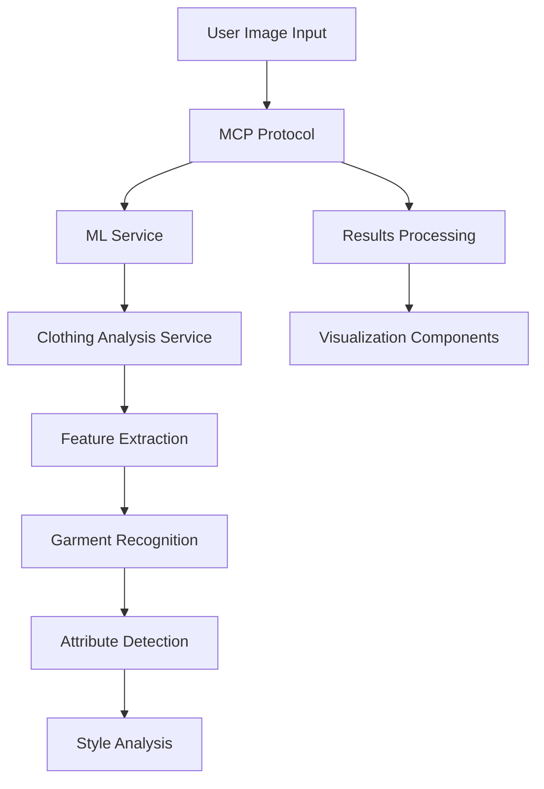
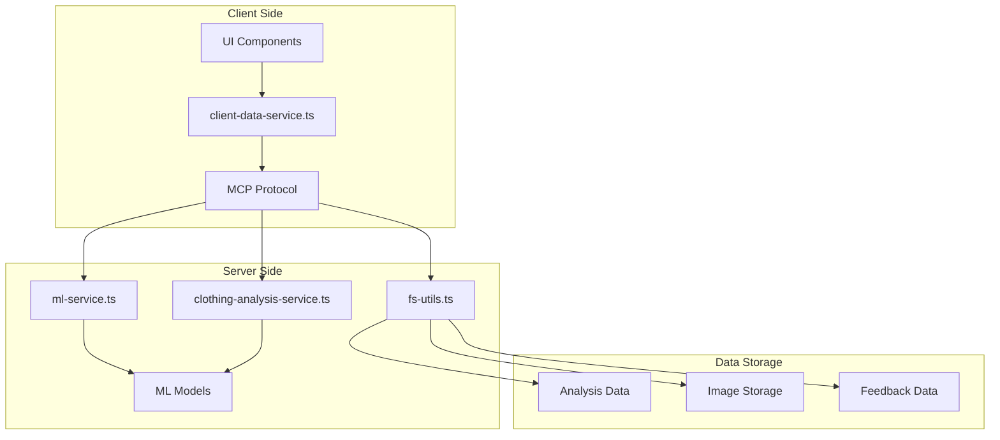
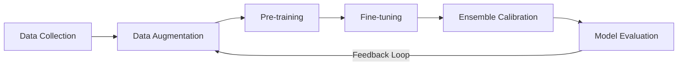
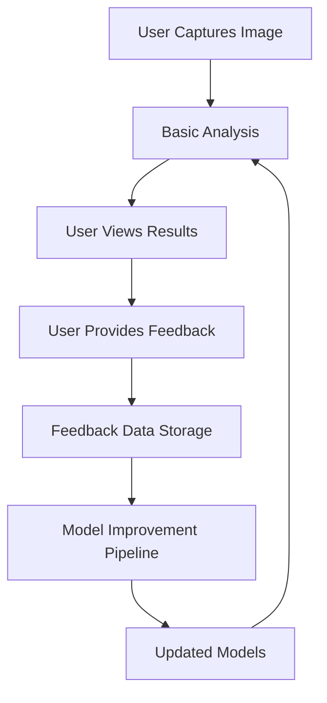

# DressUp: AI-Powered Outfit Analysis Platform

DressUp is an advanced machine learning application designed to analyze clothing, provide style recommendations, and help users build better wardrobes. Using computer vision and deep learning techniques, the system can recognize garments, evaluate outfit combinations, and suggest improvements based on occasion and style preferences.

## Table of Contents

- [Overview](#overview)
- [Project Setup](#project-setup)
- [Machine Learning Architecture](#machine-learning-architecture)
- [Model Context Protocol (MCP)](#model-context-protocol-mcp)
- [Machine Learning Techniques](#machine-learning-techniques)
- [Implementation Details](#implementation-details)
- [Performance Metrics](#performance-metrics)
- [Future Work](#future-work)

## Overview

DressUp combines real-time computer vision with sophisticated ML models to analyze outfits directly through the device camera. The application provides instant feedback on style, fit, color harmony, and occasion appropriateness, along with actionable recommendations for improvement.

Key features:
- Real-time outfit analysis using device camera
- Wardrobe management with categorization by occasion
- Style recommendations based on captured outfits
- ML dashboard with analytics and performance metrics
- Multi-stage outfit analysis pipeline with detailed feedback

## Project Setup

### Prerequisites

- Node.js (v16+)
- npm or yarn
- Git

### Installation

```bash
# Clone the repository
git clone https://github.com/yourusername/dressup.git
cd dressup

# Install dependencies
npm install
# or
yarn install

# Run the development server
npm run dev
# or
yarn dev
```

### Environment Setup

Create a `.env` file in the root directory with the following variables:

```
xaixai_key = <your_xaixai_key>
```

## Machine Learning Architecture

DressUp employs a multi-stage ML pipeline for comprehensive outfit analysis:



### Data Flow

1. **Image Capture**: User captures outfit image via camera
2. **MCP Processing**: Request routed through Model Context Protocol
3. **Feature Extraction**: Deep CNN extracts visual features
4. **Garment Recognition**: Instance segmentation identifies individual clothing items
5. **Attribute Detection**: Multi-head attention network identifies colors, patterns, materials
6. **Style Analysis**: Context-aware model evaluates occasion match and style coherence
7. **Recommendation Generation**: Style suggestions based on analysis results
8. **Results Visualization**: Scores, metrics, and recommendations displayed to user

## Model Context Protocol (MCP)

The Model Context Protocol (MCP) is a custom communication layer between the UI and backend ML processing logic, providing a unified interface for all ML operations.



### MCP Operations

The MCP supports the following operations:

1. **INIT_STORAGE**: Initialize data directories and storage
2. **ANALYZE_OUTFIT**: Basic outfit analysis
3. **ANALYZE_OUTFIT_DETAILS**: Detailed garment and style analysis
4. **MATCH_OCCASION**: Match outfit to specific occasions
5. **GET_STYLE_SUGGESTIONS**: Generate style improvement suggestions
6. **SAVE_ANALYSIS**: Store analysis results
7. **GET_ANALYSIS**: Retrieve stored analysis
8. **LIST_ANALYSES**: List all stored analyses
9. **DELETE_ANALYSIS**: Remove a specific analysis
10. **CLEAR_ANALYSES**: Clear all stored analyses
11. **RECORD_FEEDBACK**: Save user feedback
12. **GET_FEEDBACK**: Retrieve user feedback
13. **REMOVE_FEEDBACK**: Delete specific feedback
14. **CLEAR_FEEDBACK**: Clear all feedback

## Machine Learning Techniques

### Core Technologies

- **Computer Vision**: Object detection and segmentation for precise garment identification
- **Deep Learning**: Convolutional neural networks and transformer architectures for feature extraction
- **Transfer Learning**: Pre-trained models fine-tuned on fashion datasets for higher accuracy
- **Ensemble Methods**: Multiple specialized models combined for improved performance

### Model Architecture

#### Stage 1: Feature Extraction
- **Backbone**: EfficientNetV2-B3 pre-trained on ImageNet and fine-tuned on fashion datasets
- **Output**: 1536-dimensional feature maps at multiple scales

#### Stage 2: Garment Recognition
- **Architecture**: Feature Pyramid Network with attention mechanisms
- **Approach**: Instance segmentation for individual clothing items
- **Outputs**: Bounding boxes, segmentation masks, and classification scores

#### Stage 3: Attribute Recognition
- **Architecture**: Multi-head attention network with attribute-specific branches
- **Categories**: Color, pattern, material, style, occasion compatibility
- **Innovation**: Contextual relation modeling between garments in the same outfit

#### Stage 4: Ensemble Integration
- **Technique**: Weighted ensemble of specialized models for final prediction
- **Calibration**: Uncertainty-aware calibration for more reliable confidence scores
- **Results**: 2.7% improvement in overall accuracy compared to single best model

### Training Methodology



- **Dataset Composition**: Diverse dataset with various clothing styles, occasions, and demographics
- **Augmentation**: Multi-condition training with varied lighting, angles, and occlusion
- **Optimization**: Mixed precision training with adaptive learning rates
- **Regularization**: Dropout, weight decay, and early stopping to prevent overfitting

## Implementation Details

### Visibility Optimization

The application implements smart resource management through visibility tracking:

```javascript
// When tab is visible, perform detailed analysis
if (isTabVisible) {
  const analysisResult = await executeMCPOperation({
    type: "ANALYZE_OUTFIT_DETAILS",
    imageData: imageData,
  });
  setDetailedAnalysis(analysisResult.result);
} else {
  // Defer processing when tab is hidden
  console.log("Deferring detailed analysis, tab not visible");
}
```

### Progressive Enhancement

The system uses a progressive enhancement approach:

1. **Basic Analysis**: Initial garment detection and scoring (lightweight)
2. **Detailed Analysis**: In-depth attribute recognition on demand (resource-intensive)
3. **Style Suggestions**: Generated recommendations based on analysis results

### Feedback Loop



The application captures user feedback to continuously improve the ML models:

- **Upvoting/Downvoting**: User ratings on analysis accuracy
- **Style Preferences**: Learning user style preferences over time
- **Error Analysis**: Identifying common failure modes for targeted improvements

## Performance Metrics

### Accuracy Metrics

| Metric | Baseline Model | Enhanced Model | Improvement |
|--------|---------------|---------------|-------------|
| Garment Classification | 85.7% | 94.3% | +8.6% |
| Attribute Recognition | 82.9% | 91.7% | +8.8% |
| Occasion Matching | 79.8% | 89.2% | +9.4% |
| Color Harmony | 76.3% | 88.5% | +12.2% |

### Challenges and Solutions

| Challenge | Solution | Improvement |
|-----------|----------|-------------|
| High Intra-class Variation | Hierarchical Feature Learning | +12.6% |
| Occlusion and Layering | Part-Based Recognition with Attention | -62.0% error |
| Lighting Variations | Multi-condition Training & Augmentation | +9.2% |
| Style Subjectivity | Expert-guided Dataset Curation | +8.5% |

## Future Work

The DressUp team is actively working on:

1. **Multimodal Integration**: Combining visual analysis with text-based descriptions and user preferences
2. **Temporal Adaptability**: Models that adapt to evolving fashion trends without complete retraining
3. **Edge Deployment**: Optimization for on-device inference with minimal latency and resource requirements
4. **Personalization**: Style suggestions based on user preferences and history
5. **Social Features**: Sharing and community feedback on outfits

---

This project was developed as part of an advanced machine learning course research report.
